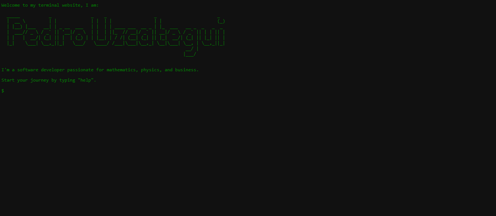

# Terminal Portfolio Concept

This is a practice project I made to create a compiler-like interface.

Just download the zip, run the index.html and you should be good to go!

You can also modify the script.js to add more commands

